# Early Fraud Detection in Vehicle Insurance Claims

## Motivation

Insurance fraud costs the UK industry over £1.1 billion annually, with financial losses ultimately passed on to consumers through higher premiums. Most fraud detection systems operate after repairs have been completed, using post-event data such as actual repair costs and labour hours to flag suspicious claims.

However, insurers have a strong incentive to identify suspicious claims earlier — at the point of initial reporting — before authorising expensive repairs. Early detection would allow investigations to begin sooner, reducing fraud losses and avoiding unnecessary payouts on fraudulent claims.

This project is motivated by the question of whether fraud can be predicted using only the information available at claim submission, and what the real-world consequences of acting on those predictions might be. In particular, it considers the ethical trade-off between fraud prevention and the harm caused by wrongly delaying legitimate claims — a dimension rarely addressed in standard fraud detection literature.

---

## Objective

The objective of this project is to investigate whether fraudulent vehicle insurance claims can be identified at the initial reporting stage, using only pre-repair information such as vehicle characteristics and estimated repair details.

The analysis evaluates four classification models — Logistic Regression, Random Forest with SMOTE, XGBoost, and a Multilayer Perceptron — comparing their ability to detect fraud while minimising the number of legitimate claims wrongly flagged for investigation.

In addition, the project critically evaluates the ethical trade-off between fraud detection and false positive harm. Each false positive represents a legitimate claimant whose repair may be delayed pending investigation, causing inconvenience and eroding trust in the insurance process. This real-world impact is quantified and analysed across vehicle price segments to assess whether early detection introduces socioeconomic bias.

---

## System Pipeline

The project follows a structured data science pipeline from raw data to model evaluation and fairness analysis.

---

### 1. Data Cleaning

The raw dataset was first processed to remove invalid and unrealistic values that could distort the analysis. This included filtering out negative or extreme values in key variables such as vehicle price, mileage, repair cost, and repair hours. Domain-informed thresholds were applied to ensure that the data reflects realistic insurance claim scenarios, retaining 97% of the original dataset.

---

### 2. Exploratory Data Analysis

#### Exploratory Visualisations

The following visualisations highlight key patterns observed during exploratory data analysis, focusing on the features available at initial claim submission.

---

**Fraud vs Legitimate Claims Distribution**
The dataset contains 18.5% fraudulent claims, providing a reasonable class balance for modelling while still reflecting real-world imbalance challenges.

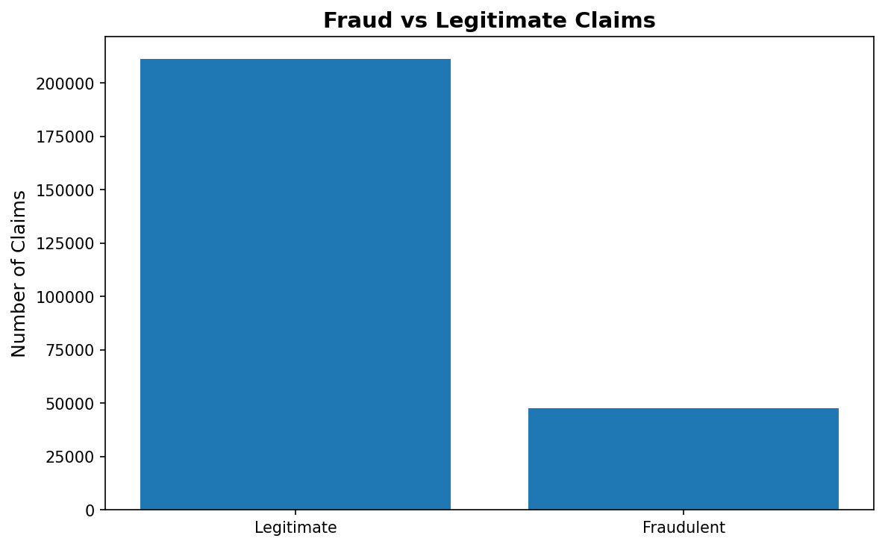

---

**Fraud Rate by Vehicle Maker**
Fraud rates vary significantly across manufacturers, ranging from 9.3% to 47.5% among makers with 500 or more claims. This variation suggests that vehicle make carries some predictive signal for early fraud detection.

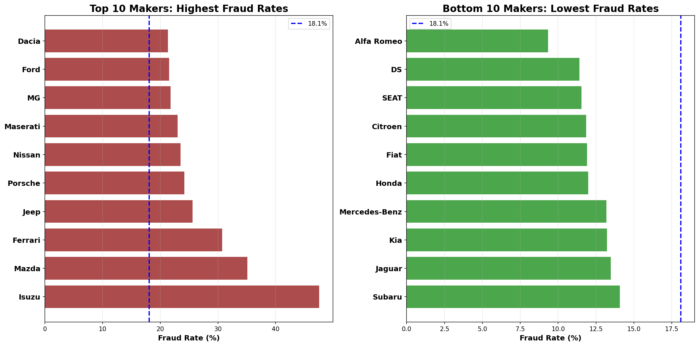

---

**Fraud Rate by Fuel Type**
Diesel and petrol vehicles account for 97% of the dataset with similar fraud rates (~18%). Hybrid vehicles show a notably lower fraud rate (~13%), while electric and other fuel types have insufficient sample sizes for reliable inference.

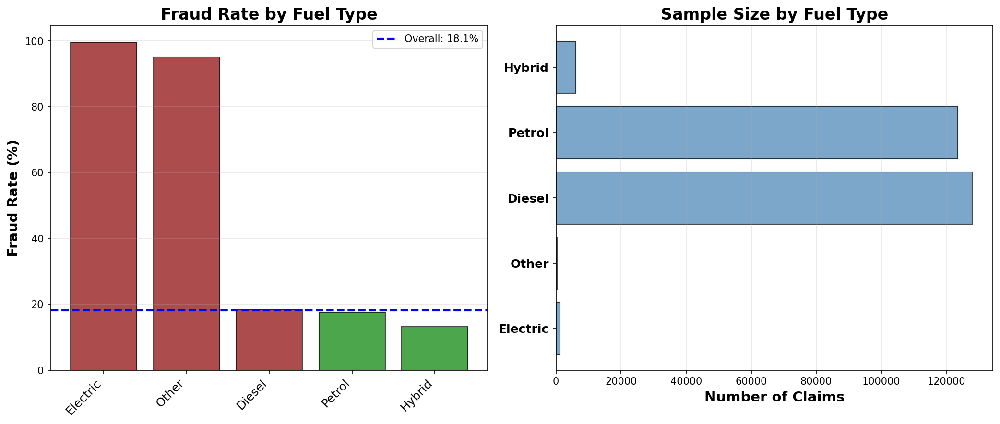

---

**Fraud Rate by Price-to-Cost Ratio**
The price-to-cost ratio demonstrates a strong non-linear relationship with fraud. Fraud probability increases from 17% at low ratios to 68% at ratios above 60%, validating this engineered feature as a key fraud indicator.

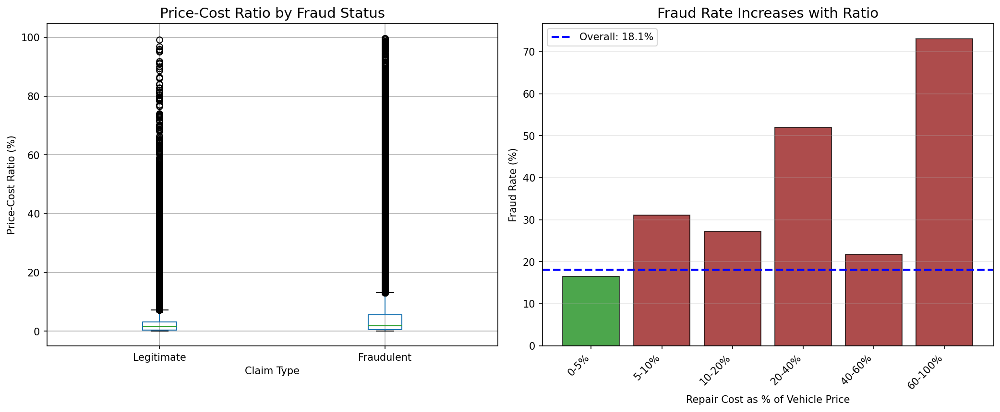

---

**Fraud Rate by Cost per Hour**
Labour cost per hour escalates sharply with fraud rate above £100/hr, reaching 45–56% fraud at rates above £300/hr. This confirms that inflated labour rates are a primary fraud mechanism.

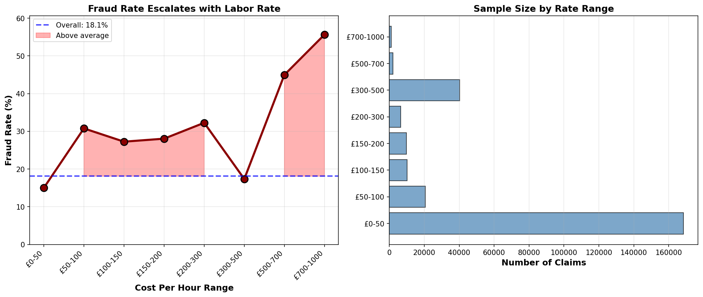

---

**Fraud Rate by Repair Complexity**
Repair complexity shows a non-linear pattern, with level 4 complexity exhibiting a 34.6% fraud rate — nearly double the dataset average — while levels 1 to 3 remain relatively uniform.

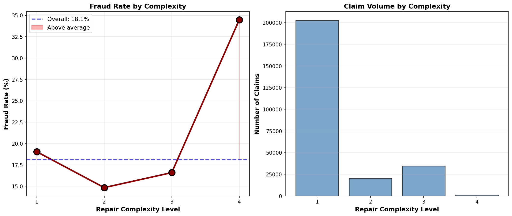

---

**Repair Hours Distribution**
Repairs exceeding 50 hours show 99–100% fraud, representing a near-certain fraud signal. Legitimate claims consistently fall below 80 hours, providing a sharp threshold for detection.

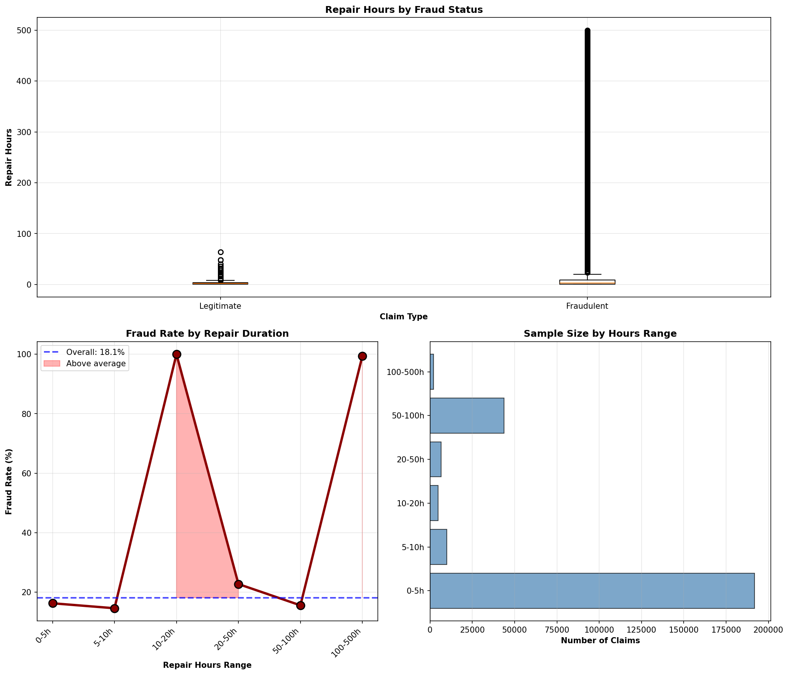

---

**Feature Correlation Matrix**
The strongest linear predictor (repair_hours, r = 0.29) shows only modest correlation with fraud, confirming that most relationships are non-linear in nature. This motivates the use of tree-based models rather than linear classifiers.

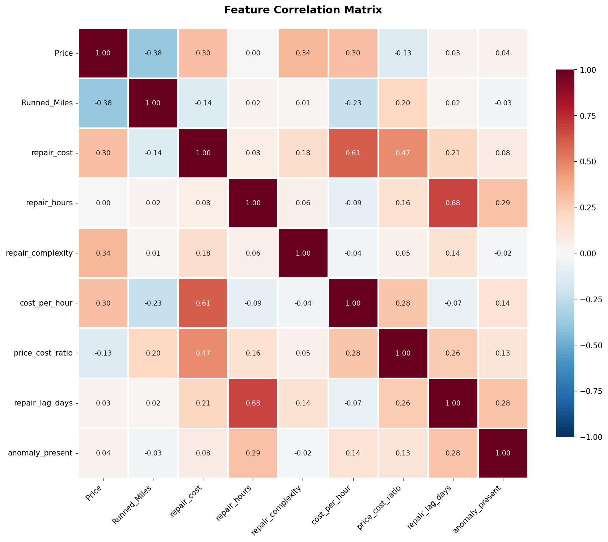

---

### 3. Feature Engineering

Three new features were created to capture known fraud mechanisms identified in insurance literature:

- **cost_per_hour** — repair cost divided by repair hours, capturing inflated labour rates beyond UK market norms (£30–£150/hr)
- **price_cost_ratio** — repair cost as a percentage of vehicle value, identifying disproportionate repair costs relative to vehicle worth
- **repair_lag_days** — days between breakdown and repair, used to detect pre-arranged repairs and claim timing manipulation

These engineered features form the basis for model training and are central to identifying fraud patterns in the data.

---

### 4. Modelling

To assess whether fraud can be identified at the point of initial reporting, four classification models were trained using only pre-repair features — vehicle characteristics and estimated repair details available at claim submission.

---

#### Feature Selection

| Type | Features |
|------|----------|
| Categorical | Maker, Body type, Fuel type, Gearbox |
| Numerical | Vehicle price, Mileage, Registration year, Issue ID, Repair complexity |

Post-repair variables such as actual repair cost, repair hours, cost per hour, and price-to-cost ratio were excluded entirely to prevent data leakage and reflect the genuine information constraints of early detection.

---

#### Class Imbalance

The dataset contains approximately 18.45% fraudulent claims and 81.55% legitimate claims. Two strategies were used to address this imbalance:

- **SMOTE** (Synthetic Minority Over-sampling Technique) was applied to the training data for the Random Forest and MLP models, generating synthetic fraud examples to balance the classes
- **scale_pos_weight** was set to 4.42 for XGBoost, enabling the model to penalise misclassification of the minority class during training without requiring synthetic data generation

SMOTE was applied only to training data in both cases to prevent leakage into the test set.

---

#### Models

| Model | Imbalance Handling |
|-------|--------------------|
| Logistic Regression | None (baseline) |
| Random Forest | SMOTE |
| XGBoost | scale_pos_weight |
| MLP (128 → 64 → 32, ReLU, Adam) | SMOTE + early stopping |

---

### 5. Results

#### Model Comparison


| Model | Caught Fraud | Missed Fraud | Wrongly Flagged | AUC |
|-------|-------------|-------------|----------------|-----|
| Logistic Regression | 4 | 14,336 | 4 | 0.528 |
| Random Forest + SMOTE | 3,860 | 10,480 | 4,576 | 0.666 |
| XGBoost | 8,361 | 5,979 | 17,705 | 0.696 |
| MLP | 4,048 | 10,292 | 6,612 | 0.656 |

---

#### Confusion Matrices

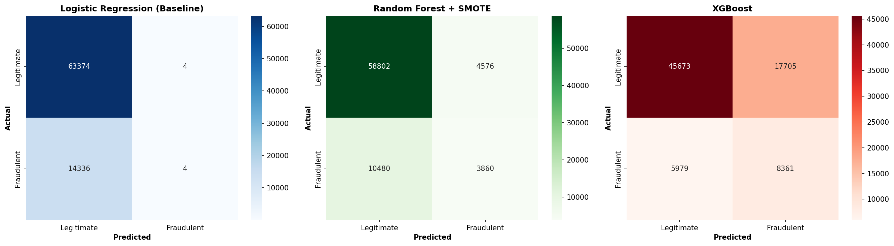

---

#### ROC Curves

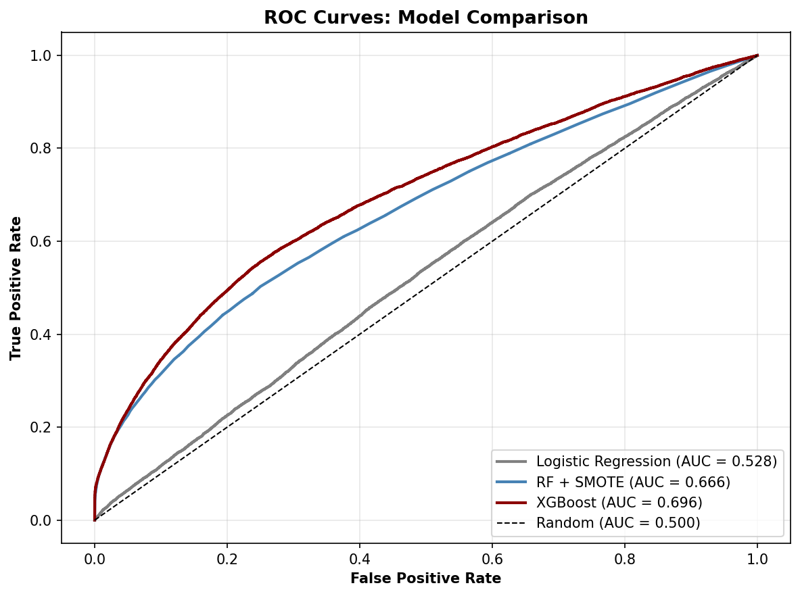

---

#### Feature Importance

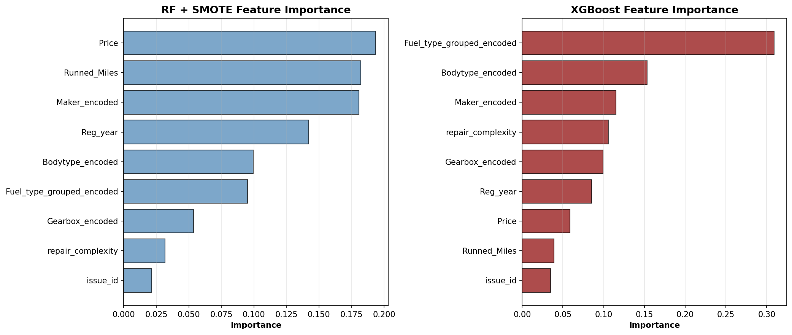

The two tree-based models prioritised fundamentally different features. Random Forest was driven by continuous variables — vehicle price (0.19) and mileage (0.18) accounted for approximately 37% of total importance. XGBoost was driven by categorical variables — fuel type alone contributed an importance of 0.30, more than any two features combined in the Random Forest model.

---

### 6. False Positive Impact Analysis

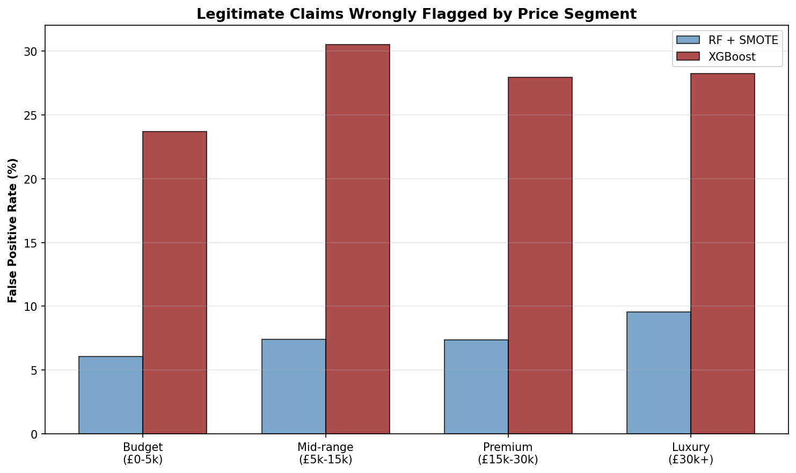

Every false positive represents a legitimate claimant whose repair is delayed pending a fraud investigation. Under the RF + SMOTE model, 4,576 legitimate claimants would be wrongly flagged, with a mean repair cost of £357.71 — slightly above the £313.02 mean for correctly cleared claims.

The false positive ratio across models highlights the trade-off clearly:

- **RF + SMOTE:** 1.2 innocent claimants investigated per fraudster caught
- **XGBoost:** 2.1 innocent claimants investigated per fraudster caught

False positive rates also varied across vehicle price segments under XGBoost (23–31%), raising proportionality concerns across all customer groups.

---

## Key Results

- All four models fall below AUC 0.70, confirming that **pre-repair features alone provide limited predictive power** for fraud detection. This reflects a fundamental constraint rather than a modelling failure — the strongest fraud signals emerge from post-repair behaviour.

- **Logistic Regression failed entirely** (recall = 0.00), confirming that the relationship between pre-repair features and fraud is non-linear, consistent with the EDA findings.

- **XGBoost** achieved the highest recall (58%) but generated 17,705 false positives — a ratio of 2.1 innocent claimants investigated per fraudster caught.

- **RF + SMOTE** offered the most balanced outcome: 27% recall, 4,576 false positives, and a ratio of 1.2 innocent claimants per fraudster caught.

- **MLP** performed comparably to RF + SMOTE despite greater complexity, consistent with literature showing tree-based models typically outperform neural networks on tabular data.

### Key Takeaway

Early fraud detection models should be used to **prioritise claims for enhanced human review**, not as standalone decision tools that automatically delay or reject claims. RF + SMOTE, with its more controlled false positive rate, is the most appropriate candidate for deployment in this context.

---

## Stack

```
scikit-learn        — LogisticRegression, RandomForestClassifier, MLPClassifier
xgboost             — XGBClassifier
imbalanced-learn    — SMOTE
pandas / numpy      — data handling
matplotlib / seaborn — visualisation
```
