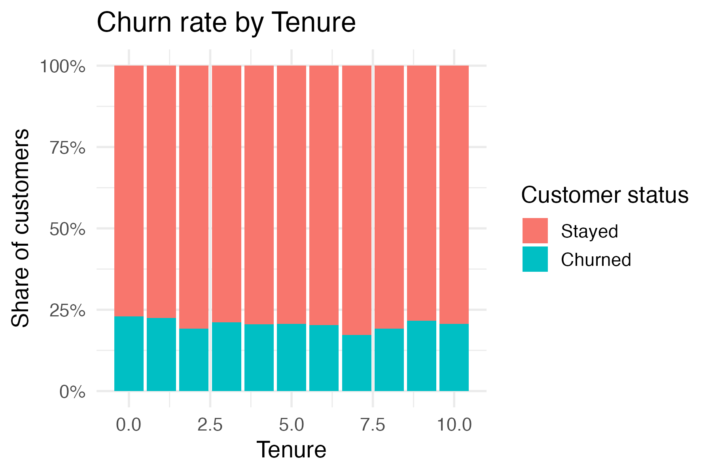
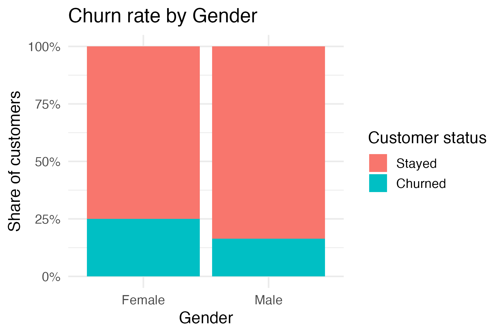
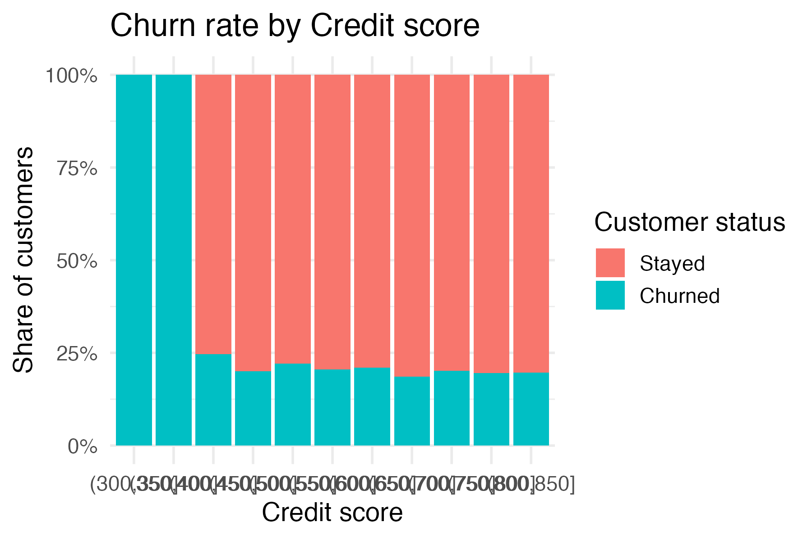
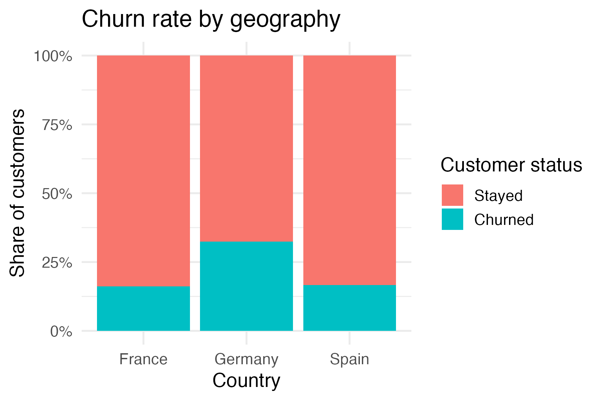
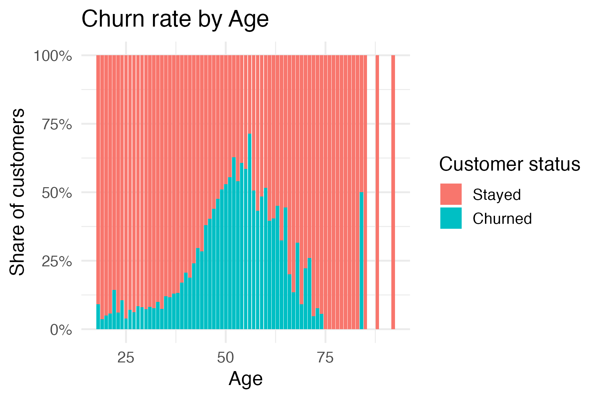
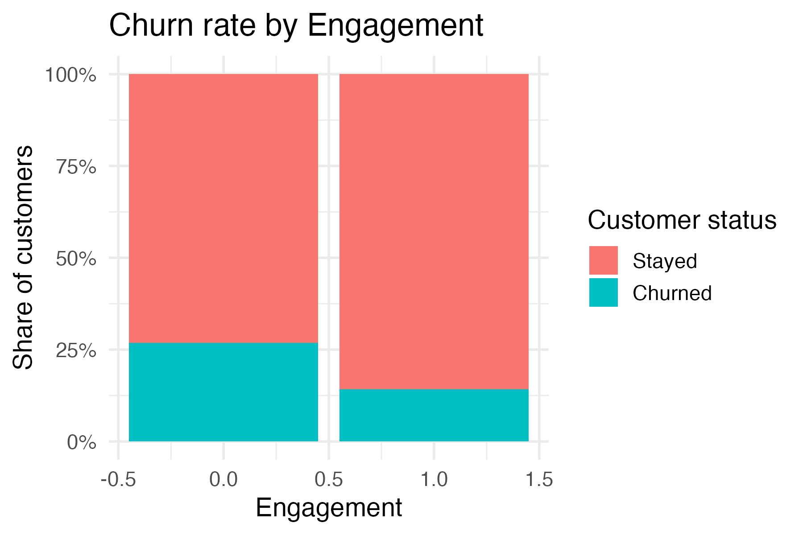
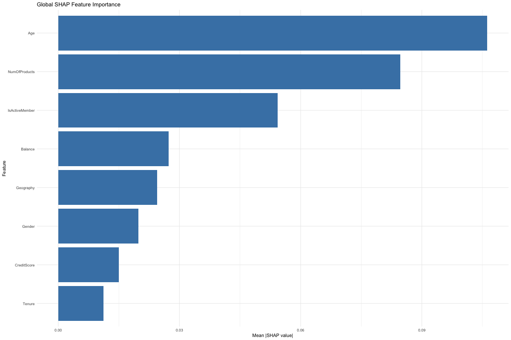
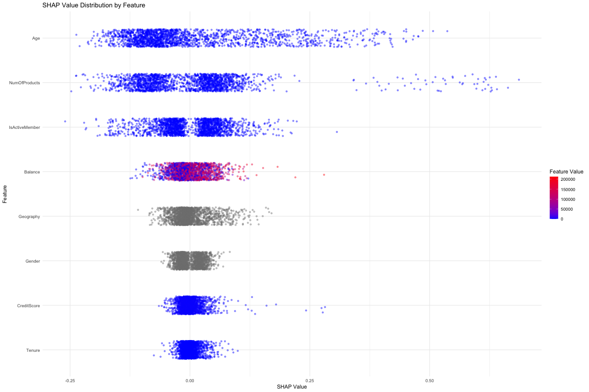
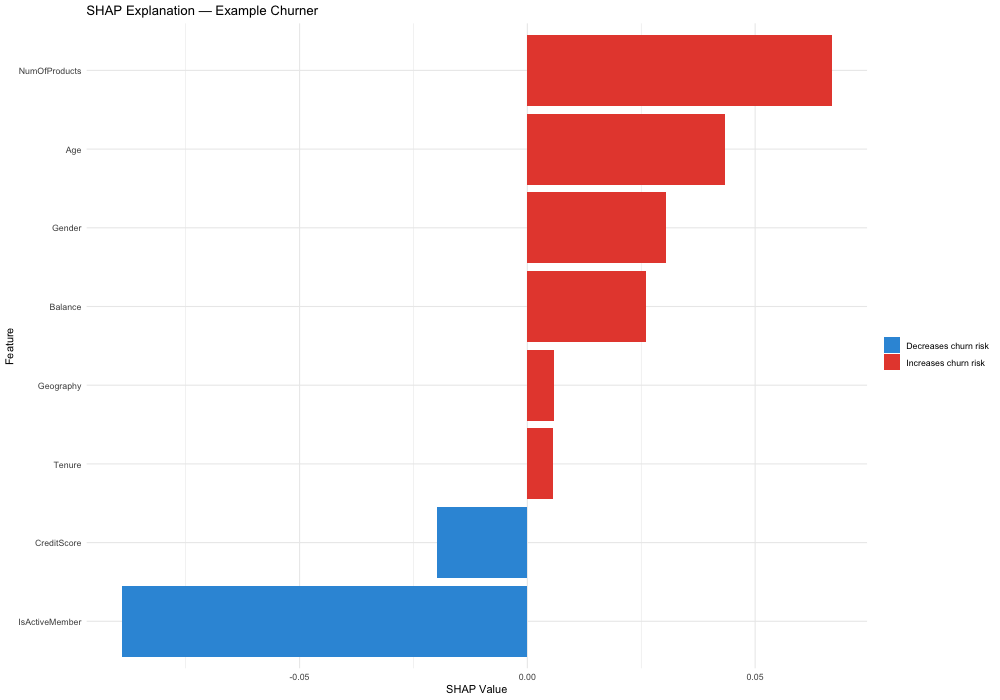
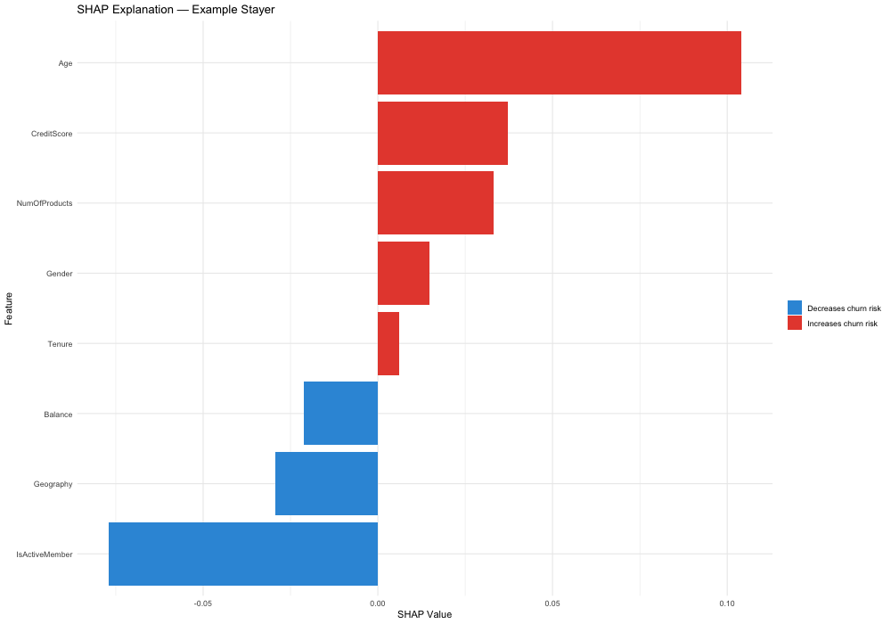

# UK Energy Churn Prediction
**Status**: ✅ Complete | **Tech**: R · ranger · SHAP · Shiny

---

## Motivation

Customer churn is one of the most costly challenges facing energy providers. Acquiring a new customer costs significantly more than retaining an existing one, yet most suppliers have no systematic way of identifying who is at risk before they leave. In a competitive UK energy market — where customers can switch suppliers with minimal friction — the ability to predict and act on churn signals early is a genuine commercial advantage.

This project builds an end-to-end churn prediction pipeline that not only flags at-risk customers but explains *why* they are at risk, making the model actionable for retention teams rather than a black box.

---

## Objective

- Predict which customers are likely to churn using demographic and account features
- Prioritise **high recall on churners** — it is costlier to miss a churner than to unnecessarily contact a stayer
- Explain model predictions at both global and individual customer level using XAI techniques
- Quantify the business value of deploying the model through a £ impact analysis
- Deliver an interactive Shiny dashboard for non-technical stakeholders

---

## Dataset

The dataset is sourced from [Kaggle](https://www.kaggle.com/) and contains **10,000 customers** with the following features:

| Feature | Description |
|---------|-------------|
| `CreditScore` | Customer credit score |
| `Geography` | Country (France, Germany, Spain) |
| `Gender` | Male / Female |
| `Age` | Customer age |
| `Tenure` | Years as a customer |
| `Balance` | Account balance (£) |
| `NumOfProducts` | Number of products held |
| `IsActiveMember` | Whether the customer is actively engaged |
| `Exited` | Target — 1 = churned, 0 = stayed |

The dataset has a **~20% churn rate**, creating a class imbalance that is addressed through class weighting in the model.

---

## Data Pipeline

```
Raw CSV → Data Cleaning → Exploratory Analysis → Feature Selection
    → Train/Test Split (80/20) → Weighted Random Forest → Evaluation
        → SHAP Explainability → Shiny Dashboard
```
### Analysis
Supervised learning models are implemented to predict if a customer will churn, using demographic, account and usage features.

**Churn and Tenure Relationship:** 

Tenure shows a relatively flat relationship with churn in this dataset, so it is not a strong driver on its own.

**Churn and Gender:**  

Gender shows a clear effect in the logistic model: the `GenderMale` coefficient is strongly negative and highly significant, indicating male customers are less likely to churn than female customers, after controlling for other features. 

**Churn and Credit Score:**  

Credit score has a clearer relationship with churn; lower scores are more associated with churn than higher scores, and it appears as a more important predictor than tenure in the models.

**Churn and Geography:**  

Churn is noticeably higher in Germany than in France and Spain, making German customers a key risk segment. 

**Churn and Age:**  

Age is roughly normally distributed around middle age (about 50–55) and does not show an extreme churn spike at any single age band.

**Churn and Activity:**  

Inactive customers churn far more than active ones, confirming that engagement is a strong protective factor.

## Models

The data is split into 80% train and 20% test. A logistic regression baseline is compared with Random Forest variants:

| Model                          | Threshold | Accuracy | Recall (churn) | Precision (churn) | Note          |
|--------------------------------|-----------|----------|----------------|-------------------|---------------|
| Logistic regression            | 0.5       | ~82      | ~21            | ~67               | Baseline      |
| Logistic regression            | 0.3       | ~79      | ~49            | ~47               | More recall   |
| Random Forest                  | 0.3       | ~83      | ~66            | ~57               | Better trade‑off|
| Weighted Random Forest (champ) | 0.3       | ~84      | ~65            | ~59               | Chosen model  |

The **weighted Random Forest** with class weights 1:4 (stayers:churners), 300 trees and `mtry = 3` is selected as the Week 2 champion model because it reaches about 65% recall on churners with ~59% precision. 

## Model Explainability
The Random Forest model was interpreted using three complementary XAI techniques to understand both global behaviour and individual predictions.

### Permutation Importance
Permutation Importance ranked features by the drop in model accuracy when each feature's values were randomly shuffled. 
IsActiveMember, Age, and NumOfProducts emerged as the strongest global predictors, meaning the model relies heavily on these features to distinguish churners from stayers.


### SHAP Beeswarm
SHAP Beeswarm Plot extended this by showing not just importance but direction of effect across all customers. 
Customers with fewer products and higher age consistently received positive SHAP values — pushing predictions toward churn — while active members and those with higher credit scores were systematically pushed away from churn risk.


### SHAP Waterfall — Example Churner
SHAP Waterfall Plots provided individual-level explanations. 
For the example churner, NumOfProducts, Age, and Balance were the dominant drivers increasing churn probability, with IsActiveMember as the only significant counterforce. 


### SHAP Waterfall — Example Stayer
The example stayer showed the opposite pattern — IsActiveMember, Geography, and Balance strongly suppressed churn risk, outweighing the mild upward pressure from Age and CreditScore. Together, these plots confirm that membership status and product engagement are the most decisive factors in the model's predictions.


---

## Business Case — £ Impact

Predicting churn is only valuable if it drives action. This section quantifies what the model is worth to a retention team.

| Assumption | Value |
|------------|-------|
| Total customers | 10,000 |
| Annual churn rate | ~20% (2,000 customers) |
| Average revenue per customer | £800 / year |
| Model recall | 0.65 → flags 1,300 true churners |
| Model precision | 0.59 → 2,203 total customers flagged |
| Retention outreach cost | £30 per customer contacted |
| Retention success rate | 30% of contacted churners saved |

**Without the model:** 2,000 customers lost per year → **£1.6M revenue at risk.**

**With the model:**
- 2,203 customers flagged for outreach → campaign cost: **£66,090**
- 1,300 true churners correctly identified → 390 retained at 30% success rate
- Revenue saved: **£312,000**
- Net saving: **£245,910**
- **ROI: 3.7× — for every £1 spent on outreach, £3.70 is recovered**

> Scaled to a real UK energy portfolio of 500,000+ customers, this approach translates to **£12M+ in annual savings**.

---

## Key Takeaway

Membership status and product engagement are the most decisive factors separating churners from stayers. A customer who is inactive and holds only one product is at significantly elevated risk — regardless of salary, tenure, or credit score.

---

## Shiny App — Interactive Churn Risk Tool

A fully interactive Shiny dashboard allows retention teams to profile any customer and instantly see their churn probability alongside a live SHAP waterfall explaining the prediction.


---

## Tech Stack

| Tool | Purpose |
|------|---------|
| R | Data processing, modelling, visualisation |
| `ranger` | Weighted Random Forest classifier |
| `fastshap` | SHAP value computation |
| `shiny` | Interactive churn risk dashboard |
| `ggplot2` | All visualisations |
| `dplyr / tidyr` | Data wrangling |

---

## How to Run

1. Clone the repo:
```bash
git clone https://github.com/Skm48/Steve_Portfolio.git
```

2. Open `projects/uk-energy-churn/` in RStudio

3. Install dependencies:
```r
install.packages(c("shiny", "ranger", "fastshap", "ggplot2", "dplyr", "tidyr", "scales"))
```

4. Run the app:
```r
shiny::runApp("projects/uk-energy-churn/app.R")
```

---

## Code & Demo

**Full notebook**: `notebooks/churn_analysis.Rmd`  
**Shiny app**: `app.R`
